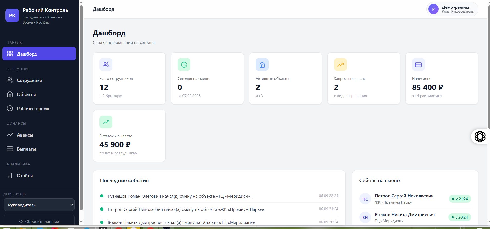
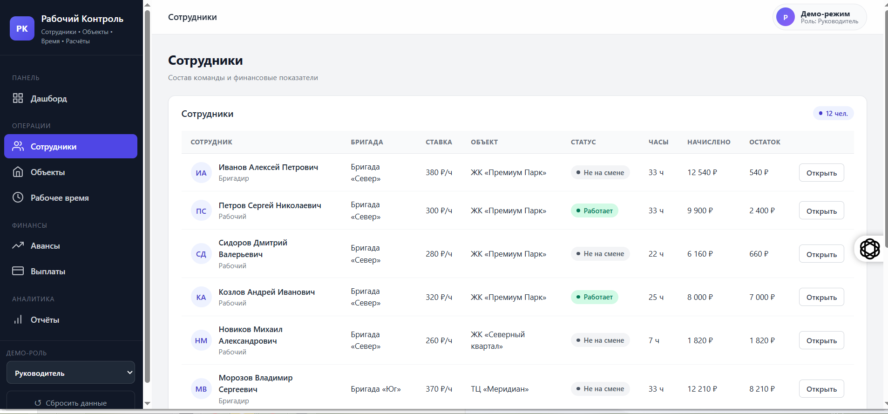
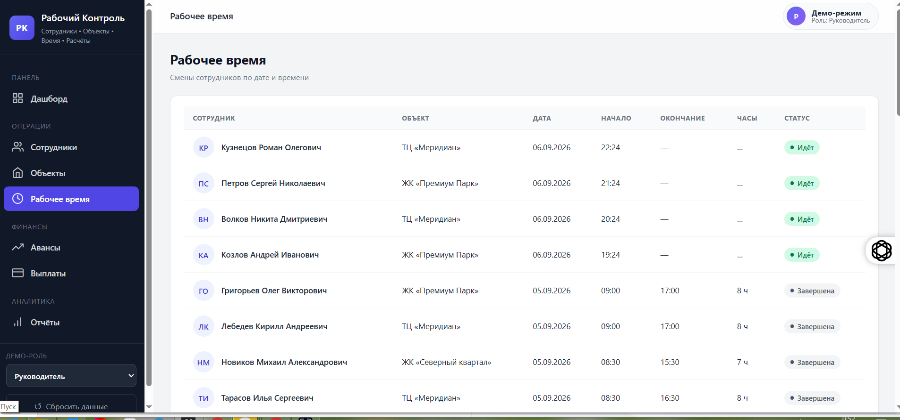
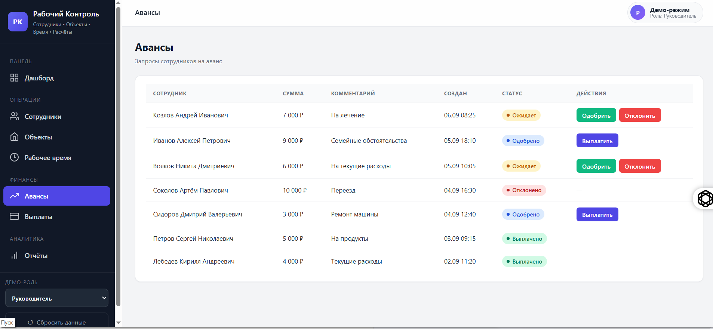
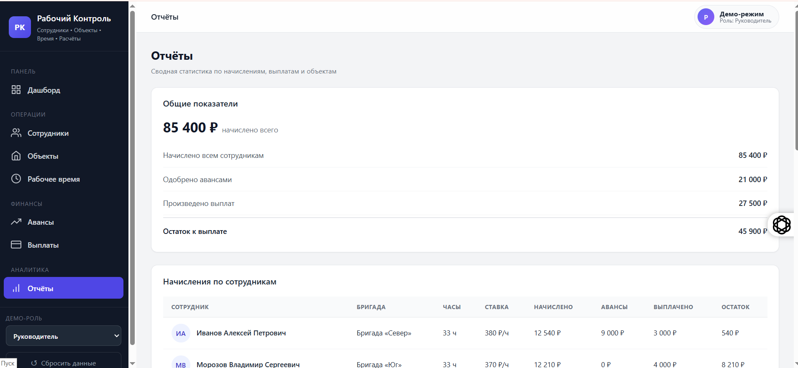

# Рабочий Контроль

Учебный MVP веб-приложения для учёта сотрудников, объектов, рабочего времени, авансов и выплат.

## Возможности

- учёт сотрудников и бригад;
- учёт объектов;
- начало и завершение рабочих смен;
- автоматический расчёт отработанных часов;
- расчёт начислений по ставке;
- запросы и обработка авансов;
- фиксация выплат;
- расчёт остатка к выплате;
- отчёты и сводный дашборд;
- хранение демо-данных в localStorage;
- адаптивный интерфейс.

## Демо-роли

- Рабочий
- Бригадир
- Руководитель
- Бухгалтер

Для каждой роли предусмотрен собственный набор доступных разделов и действий.

## Запуск

```bash
npm install
npm start

```
## Демо

🔗 [Открыть работающий проект](https://rabochiy-kontrol-tracker-production.up.railway.app)

## Скриншоты

### Дашборд


### Сотрудники


### Рабочее время


### Авансы


### Отчёты

